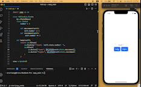

<div align="center">


<hr>

**✨ Blazingly fast web apps without template, using your favorite Python frameworks.**

</div>

## ⚡️ 1. Optimized for SEO

Pages created with Capy loads instantly. Capy reactive but only renders dynamic content when necessary, improving SEO significantly unlike its React counterparts.


## ⚡️ 2. 30+ stunning, accessibile components

Capy offers 30+ commonly used components that are stunning and accessible. Build a complex apps with just a few lines of code


## 🥳 3. Built for developers

Capy is completely hackable. If you can write it with React or HTML, you can build it in Capy in Python.


## 🫧 Example

Let's creat an image caption generator that accept an image upload:

&nbsp;

<div align="center">

</div>

&nbsp;

This is all done in one Python file in a Flask project!

```python
from flask import Flask
from capy import Capy

app = Flask(__name__)

class IndexView:
  @StateObject
  class State:
    selected_image = None
    image_processed = (False, None)

  def applePayPressed(self):
    # handle payment
    pass

  def body(self):
    return VStack(
      ConditionalView(
        self.State.image_processed[0],
        true_view=VStack(
          Image(self.State.selected_image)
            .frame(300, 300)
            .corner_radius(20),
          Text(self.State.image_processed[1])),
        false_view=FilePicker(type=PHOTOS, 
                              selected_item = self.State.selected_image)),
      ApplePayButton(on_click=self.applePayPressed))

# the minimal Flask app
@app.route('/')
def index():
    return IndexView()
app.run(host='0.0.0.0', port=81)

```

## License

Capy is licensed under the [Apache License 2.0](LICENSE).